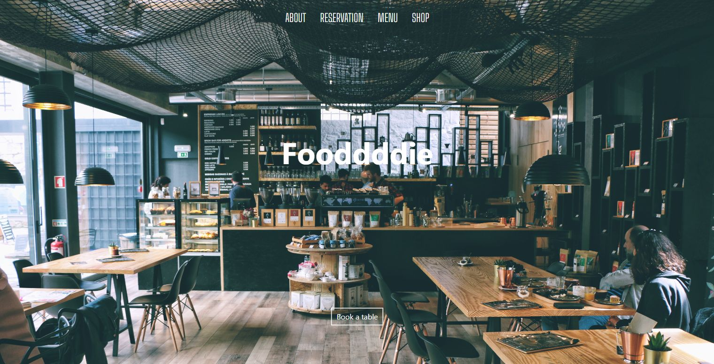
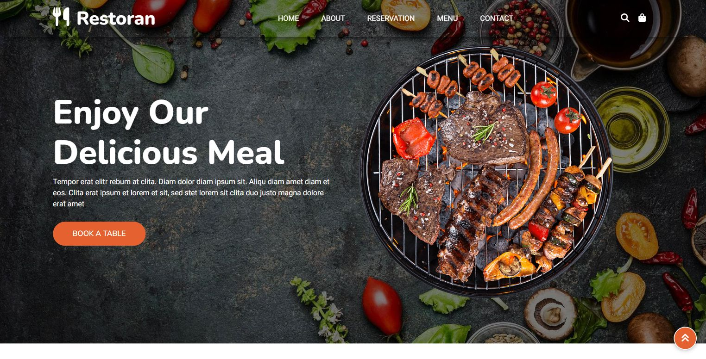
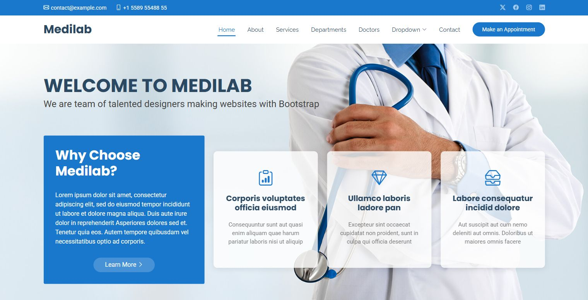
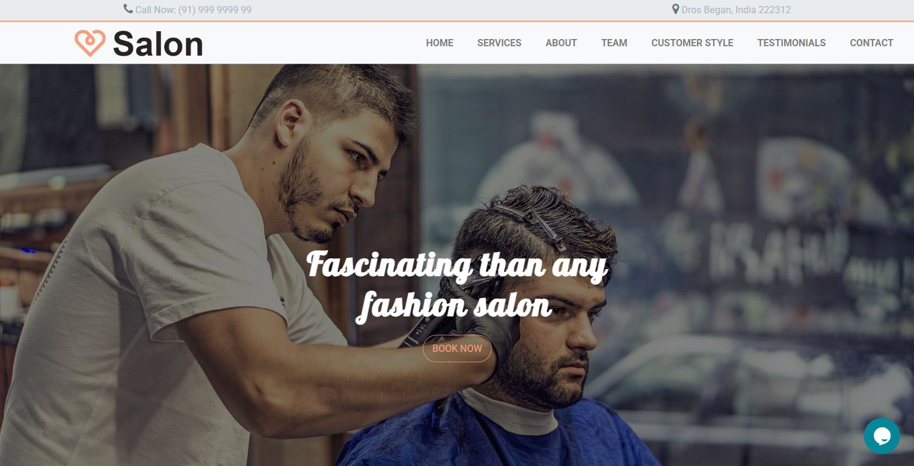

# Seraphim Template Catalog Shortlist

This is the first approval pass for an ultra-premium industry template catalog. Nothing here is wired into generation yet; these are candidates for your visual approval and license triage.

## What The Agent Will Do

The new project-local skill is:

`C:\Users\Chad\Documents\Niche Technologies\niche-demo-launcher\.agents\skills\template-curator-agent\SKILL.md`

It searches template sources, checks license signals, captures screenshots, scores candidates, and marks each template as import, adapt, inspiration-only, or reject.

## Screenshot-Backed Candidates

### Restaurant Website

- Source: https://github.com/YaninaTrekhleb/restaurant-website
- Demo: https://yaninatrekhleb.github.io/restaurant-website/
- Industry fit: restaurant, cafe, lounge, hospitality.
- License signal: no license detected, so inspiration-only unless permission is clarified.
- Strength: cinematic first viewport with strong real-world hospitality image.
- Weakness: thin conversion story and not enough premium section depth by Seraphim standards.
- Recommendation: use as visual inspiration, not import.

### Restoran

- Source: https://github.com/codewithshabbir/Restoran
- Demo: https://codewithshabbir.github.io/Restoran/
- Industry fit: restaurant, grill, food service, catering.
- License signal: no license detected, so inspiration-only unless permission is clarified.
- Strength: high-impact food hero and direct CTA.
- Weakness: common Bootstrap-template feel below the surface; copy is filler.
- Recommendation: use visual motifs only; rebuild in Seraphim style.

### MediLab

- Source: https://github.com/themewagon/MediLab
- Demo: https://themewagon.github.io/MediLab/
- Industry fit: medical, clinic, dental-adjacent, professional health.
- License signal: verify before import.
- Strength: familiar appointment-oriented clinic structure.
- Weakness: visually dated and heavily Bootstrap-coded; hero copy is generic.
- Recommendation: use as a medical section-map reference, not as visual final quality.

### Salon

- Source: https://github.com/technext/Salon
- Demo: https://technext.github.io/Salon/
- Industry fit: salon, barber, spa, beauty.
- License signal: verify before import.
- Strength: strong service-industry positioning and obvious booking action.
- Weakness: older typography, generic claims, and placeholder contact details.
- Recommendation: structure seed only; requires a full premium refresh.

## Additional Candidates To Review Next

| Candidate | Industry | Source | Demo | License signal | Recommended use |
| --- | --- | --- | --- | --- | --- |
| Awesome Landing Pages | General landing packs | https://github.com/PaulleDemon/awesome-landing-pages | https://awesome-landing-pages.netlify.app/ | MIT reported by GitHub API | Import/adapt selected sections after visual review |
| Uisual Freebies | General premium UI/layout | https://github.com/uisual/freebies | https://uisual.com/freebies/ | MIT reported by GitHub API | Adapt spacing, type, and conversion layouts |
| DiwaDental | Dental/medical | https://github.com/gridtemplate/DiwaDental-HTML5-and-Bootstrap5-Template-For-Dentist-and-Medical-Clinics | https://www.gridtemplate.com/templates/diwadental-html5-and-bootstrap5-template-for-dentist-and-medical-clinics/ | MIT verified by GitHub/raw license | Build dental/clinic pack seed |
| Car Mechanic Shop | Auto repair/tire shop | https://github.com/saaqi/car-mechanic-shop | https://saaqi.github.io/car-mechanic-shop/ | MIT verified by GitHub/raw license | Build auto/tire pack seed |
| Faname Real Estate | Real estate/architecture | https://github.com/radwan503/Faname--RealEstate | https://radwan503.github.io/Faname--RealEstate/ | no license detected | Inspiration-only |
| Law Firm | Legal/professional services | https://github.com/lucasbelpiede/Law_Firm | https://github.com/lucasbelpiede/Law_Firm | MIT reported by GitHub API | Needs demo/code review |

## My Approval Recommendation

Approve **Awesome Landing Pages**, **Uisual Freebies**, **DiwaDental**, and **Car Mechanic Shop** for the next implementation pass. Use **Restaurant Website** and **Restoran** only as restaurant visual references unless we verify permissive licensing.

The open-source material is useful, but most is not mind-blowing unmodified. The winning approach is to treat these as raw material, then build Seraphim-owned packs with our own cinematic hero systems, industry imagery, SEO/schema, CTA flow, FAQ, polished footer, mobile nav, and Magic UI-inspired effects.
